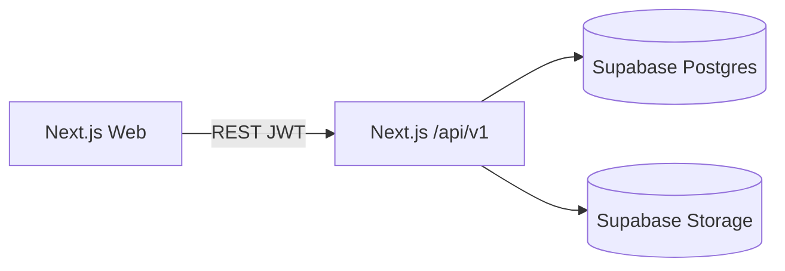

# Koridor Architecture — Phases 1–6

## System context

Koridor is a modular trade operating system. Phase 1 established identity, tenancy, RBAC, and observability. Phase 2 adds the **Trust Engine**. Phase 3 adds the **Trade Engine**. Phase 4 adds **Finance** (wallets, escrow, ledger). Phase 5 adds **Compliance**. Phase 6 adds **Logistics** (shipments, tracking, PoD).

Production auth and Trust APIs run in the Next.js App Router (`apps/web/src/app/api/v1`). NestJS (`apps/api`) remains available for local/full-service work; Prisma schemas stay in sync.

## Backend modules (Phase 2–6)

| Area | Responsibility |
|------|----------------|
| `trust` | Trust score read/recompute |
| `documents` | Upload/list/delete + signed download URLs |
| `kyc` | Member identity submission |
| `verification` | KYB cases + admin review |
| `registry` | Type listings (farmer/coop/exporter/buyer) |
| `contacts` | Organisation contacts on org profile |
| `rfqs` / `offers` | RFQ lifecycle + seller offers |
| `contracts` | Contract formation, signatures, milestones |
| `finance` | Wallets, ledger, escrow fund/release |
| `compliance` | Certificates, printable payloads, approvals, expiry |
| `logistics` | Shipments, tracking events, proof of delivery |

## Trust score

Deterministic 0–100 score persisted on `trust_profiles`:

| Component | Max |
|-----------|-----|
| Profile completeness | 25 |
| Required documents (license + tax) | 25 |
| Org verification status | 30 |
| Member KYC verified | 20 |

Recomputed on document upload, verification decision, KYC submit, contact/org profile changes.

## Multi-tenancy model

- **User** authenticates globally.
- **Organisation** is the trust boundary.
- **OrganisationMember** links users with org-scoped roles.
- **SystemRole** drives platform permissions (including `trust:*`, `documents:*`, `registry:read`, `trade:*`, `finance:*`, `compliance:*`, `logistics:*`).

## Security

- Bcrypt password hashing (12 rounds)
- Short-lived access JWT + hashed refresh tokens in DB
- Private Supabase Storage bucket `org-documents` (service-role uploads, signed URLs)
- RLS enabled on all app tables (deny PostgREST; app uses DB password)
- Soft deletes + audit on sensitive mutations

## Compliance (Phase 5)

| Flow | Notes |
|------|-------|
| Draft certificate | Org members with `compliance:write` |
| Submit for approval | Creates `ComplianceApproval` PENDING |
| Review | Gov / chamber / admin with `compliance:review` |
| Expiry | Lazy mark `EXPIRED` + expiry dashboard buckets |
| Print | Browser print of structured `payload` JSON |

APIs: `/api/v1/compliance/certificates`, `.../approvals`, `.../expiry`.

## Finance (Phase 4)

| Flow | Notes |
|------|-------|
| Wallet | Auto-created per org+currency; top-up credits available balance |
| Open escrow | From trade `EscrowRequest` → `EscrowAccount` OPEN |
| Fund | Buyer holds funds (`available` → `held`) |
| Release | Seller receives credit; request marked RELEASED |

APIs: `/api/v1/finance/wallet`, `/api/v1/finance/escrow`.

## Logistics (Phase 6)

| Flow | Notes |
|------|-------|
| Create shipment | From trade `ShipmentRequest` |
| Book / transit | Status + tracking events |
| Deliver | Proof of delivery record |

APIs: `/api/v1/logistics/shipments`, `.../shipments/[id]`.

## API conventions

- Prefix: `/api/v1`
- Response: `{ success, data, meta? }`
- Errors: `{ success: false, error: { code, message } }`
