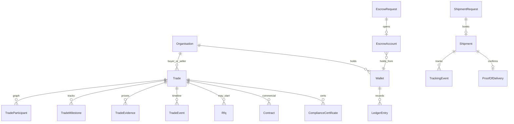
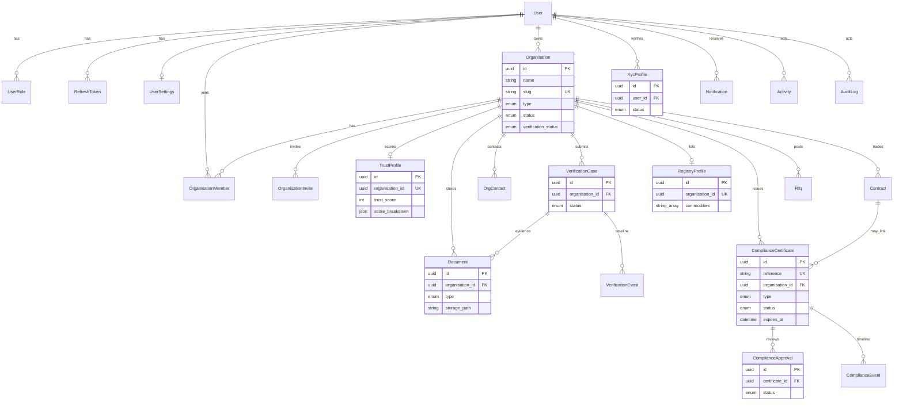

# Entity Relationship Overview — Phases 1–6 + Stage 3.5

The **Trade Passport** is the parent hub. Contract remains the signed commercial instrument; escrow/shipment attach through contract and surface in the Trade Workspace.

